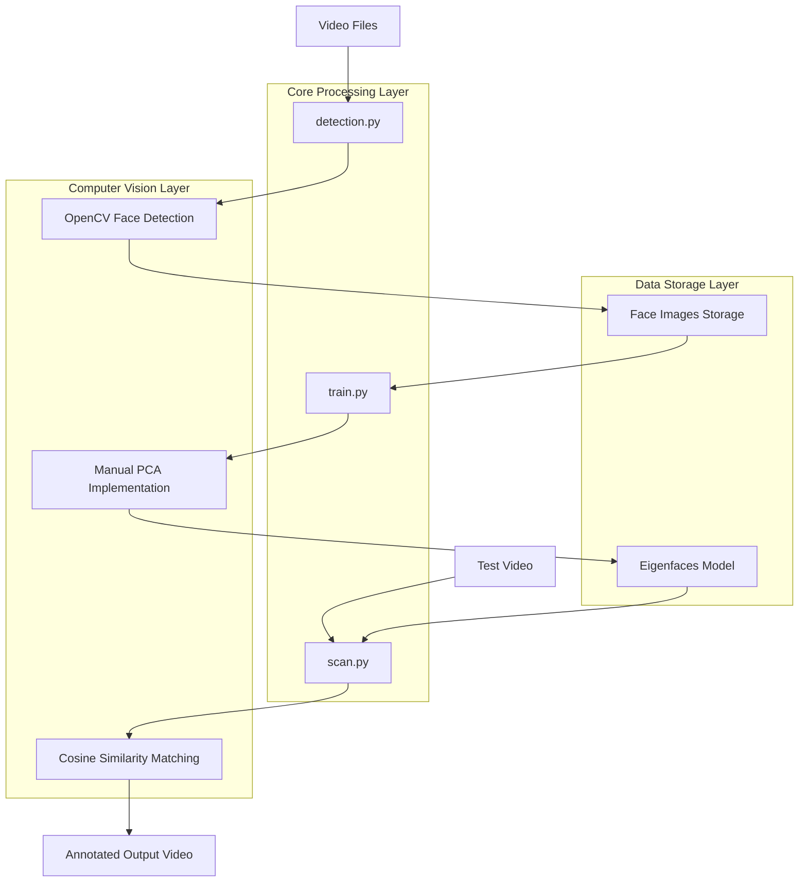

# Face Detection & Recognition System - Technical Architecture Document

## 1. Architecture Design



## 2. Technology Description

* **Core Language**: Python 3.8+

* **Computer Vision**: OpenCV 4.x for video processing and template matching

* **Mathematical Operations**: NumPy for matrix calculations and PCA implementation

* **Data Storage**: JSON for metadata, pickle for model serialization

* **No ML Libraries**: Manual PCA implementation without sklearn or similar libraries

## 3. File Structure

| File/Directory | Purpose                                                    |
| -------------- | ---------------------------------------------------------- |
| detection.py   | Face detection from training video, extract and save faces |
| train.py       | Manual PCA training, eigenface generation                  |
| scan.py        | Face recognition and video annotation                      |
| /faces/        | Storage directory for extracted face images                |
| /models/       | Storage for trained PCA models and eigenfaces              |
| /videos/       | Input video files (Joseph\_Lai.mp4, test.mp4)              |
| /output/       | Annotated output videos                                    |

## 4. Core Components

### 4.1 Face Detection (detection.py)

**Input Parameters:**

| Parameter     | Type   | Description                       |
| ------------- | ------ | --------------------------------- |
| video\_path   | string | Path to input video file          |
| output\_dir   | string | Directory to save extracted faces |
| cascade\_file | string | Haar cascade classifier file path |

**Output:**

| Output       | Type  | Description                                             |
| ------------ | ----- | ------------------------------------------------------- |
| face\_images | files | Individual face image files                             |
| metadata     | JSON  | Face detection metadata with timestamps and coordinates |

**Core Functions:**

```python
def detect_faces_in_video(video_path, output_dir)
def save_face_metadata(faces_data, video_name)
def extract_and_save_faces(frame, faces, frame_number)
```

### 4.2 PCA Training (train.py)

**Input Parameters:**

| Parameter     | Type    | Description                      |
| ------------- | ------- | -------------------------------- |
| faces\_dir    | string  | Directory containing face images |
| model\_output | string  | Path to save trained model       |
| n\_components | integer | Number of principal components   |

**Output:**

| Output         | Type        | Description                 |
| -------------- | ----------- | --------------------------- |
| eigenfaces     | numpy.array | Principal component vectors |
| mean\_face     | numpy.array | Average face vector         |
| face\_features | numpy.array | Projected face features     |

**Core Functions:**

```python
def manual_pca(
```

